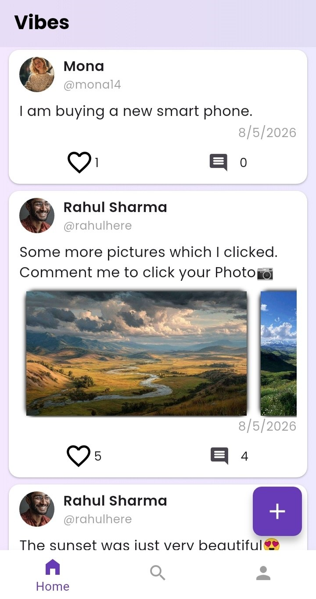
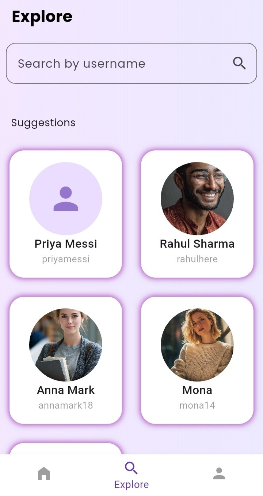

# Vibes
A full social media mobile app built with Flutter and Firebase.

## Features
- Email authentication (login & signup)
- Create posts with multiple images
- Like & unlike posts with animation
- Comment on posts
- Follow & unfollow users
- Search users
- Explore random user suggestions
- Profile management with photo upload
- Delete your own posts
- Realtime updates with Firestore streams
- Image zoom on user post images

## Tech Stack
- Flutter
- Firebase Auth
- Cloud Firestore
- Cloud Storage (via Cloudinary)
- Provider (state management)

## Architecture
Service → Provider → UI pattern for clean separation of concerns.

## Screenshots

## Demo
[Watch Demo Video](https://youtu.be/9Q9vdGhmD_4?si=n2X4FxSJz2S4FBeU)
